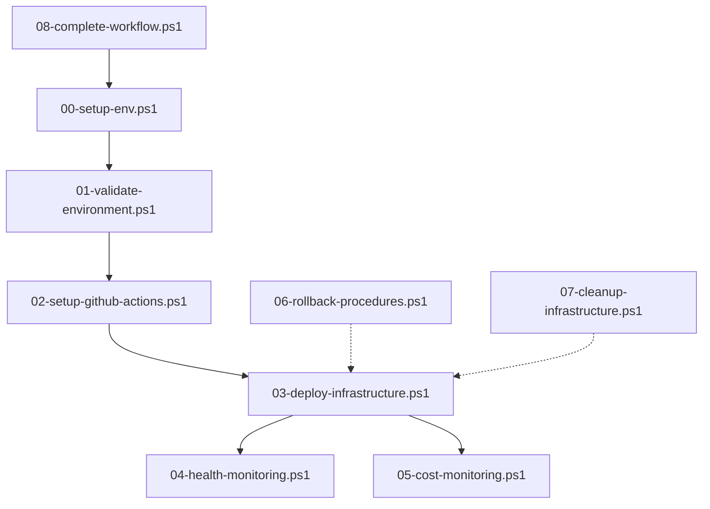

# Scripts Reference - Terraform Atlantis Workshop

## 📜 PowerShell Script Documentation

This document provides comprehensive reference documentation for all PowerShell scripts in the **Environment Provisioning Automation with Terraform and Atlantis** workshop.

## 🗂️ Script Overview

The workshop includes 9 PowerShell scripts organized in a numbered workflow system:

| Script                          | Purpose                             | Execution Time | Dependencies        |
| ------------------------------- | ----------------------------------- | -------------- | ------------------- |
| `00-setup-env.ps1`              | Environment setup and configuration | 2-3 minutes    | None                |
| `01-validate-environment.ps1`   | Environment validation              | 1-2 minutes    | PowerShell, AWS CLI |
| `02-setup-github-actions.ps1`   | GitHub Actions configuration        | 3-5 minutes    | Git, GitHub CLI     |
| `03-deploy-infrastructure.ps1`  | Infrastructure deployment           | 10-15 minutes  | Terraform, AWS CLI  |
| `04-health-monitoring.ps1`      | System health monitoring            | 1-2 minutes    | AWS CLI, curl       |
| `05-cost-monitoring.ps1`        | Cost monitoring and alerts          | 1-2 minutes    | AWS CLI             |
| `06-rollback-procedures.ps1`    | Emergency rollback procedures       | 5-10 minutes   | Terraform, AWS CLI  |
| `07-cleanup-infrastructure.ps1` | Infrastructure cleanup              | 5-10 minutes   | Terraform, AWS CLI  |
| `08-complete-workflow.ps1`      | Master orchestration script         | 20-30 minutes  | All above           |

## 📋 Script Details

### 00-setup-env.ps1

#### Purpose

Initializes the workshop environment, creates configuration files, and sets up environment variables.

#### Synopsis

```powershell
.\scripts\00-setup-env.ps1 [-Force] [-SkipValidation] [-ConfigFile <path>]
```

#### Parameters

-   **`-Force`** (Switch): Overwrite existing configuration files
-   **`-SkipValidation`** (Switch): Skip environment validation during setup
-   **`-ConfigFile`** (String): Path to custom configuration file

#### Example Usage

```powershell
# Basic setup
.\scripts\00-setup-env.ps1

# Force overwrite existing configuration
.\scripts\00-setup-env.ps1 -Force

# Setup with custom configuration
.\scripts\00-setup-env.ps1 -ConfigFile "config/custom.json"
```

#### Functions

-   **`New-EnvironmentConfig`**: Creates .env configuration file
-   **`Set-WorkshopVariables`**: Sets PowerShell environment variables
-   **`Initialize-Directories`**: Creates required directory structure
-   **`Test-Prerequisites`**: Validates required tools are installed

#### Output Files

-   `.env` - Environment configuration
-   `config/workshop.json` - Workshop configuration
-   `logs/setup-$(Get-Date -Format 'yyyyMMdd').log` - Setup log file

#### Exit Codes

-   **0**: Success
-   **1**: Missing prerequisites
-   **2**: Configuration error
-   **3**: Permission error

---

### 01-validate-environment.ps1

#### Purpose

Validates that all required tools and configurations are properly set up before workshop execution.

#### Synopsis

```powershell
.\scripts\01-validate-environment.ps1 [-Detailed] [-FixIssues] [-ReportPath <path>]
```

#### Parameters

-   **`-Detailed`** (Switch): Perform detailed validation checks
-   **`-FixIssues`** (Switch): Attempt to fix common issues automatically
-   **`-ReportPath`** (String): Path to save validation report

#### Example Usage

```powershell
# Basic validation
.\scripts\01-validate-environment.ps1

# Detailed validation with auto-fix
.\scripts\01-validate-environment.ps1 -Detailed -FixIssues

# Generate validation report
.\scripts\01-validate-environment.ps1 -ReportPath "reports/validation.json"
```

#### Validation Checks

1. **PowerShell Version**: Minimum 7.0
2. **AWS CLI**: Installed and configured
3. **Terraform**: Version 1.6.0+
4. **Git**: Installed and configured
5. **Docker**: Running (for Atlantis)
6. **Network Connectivity**: AWS and GitHub access
7. **Permissions**: AWS IAM permissions
8. **Disk Space**: Minimum 5GB free

#### Functions

-   **`Test-PowerShellVersion`**: Validates PowerShell version
-   **`Test-AWSConfiguration`**: Validates AWS CLI setup
-   **`Test-TerraformInstallation`**: Validates Terraform installation
-   **`Test-NetworkConnectivity`**: Tests internet and AWS connectivity
-   **`Test-IAMPermissions`**: Validates AWS permissions
-   **`Repair-CommonIssues`**: Attempts to fix common problems

#### Output

```powershell
✅ PowerShell Version: 7.3.0 (Required: 7.0+)
✅ AWS CLI: 2.13.0 (Required: 2.0+)
✅ Terraform: 1.6.0 (Required: 1.6.0+)
✅ Git: 2.41.0 (Required: 2.30+)
✅ Docker: 24.0.2 (Required: 20.0+)
✅ AWS Connectivity: OK
✅ GitHub Connectivity: OK
✅ IAM Permissions: OK (19/19 permissions verified)
✅ Disk Space: 45.2 GB available (Required: 5 GB)

🎉 Environment validation completed successfully!
```

#### Exit Codes

-   **0**: All validations passed
-   **1**: Critical validation failures
-   **2**: Minor issues found
-   **3**: Unable to perform validation

---

### 02-setup-github-actions.ps1

#### Purpose

Configures GitHub repository with necessary workflows, secrets, and webhook settings for Atlantis integration.

#### Synopsis

```powershell
.\scripts\02-setup-github-actions.ps1 [-Repository <repo>] [-Token <token>] [-SkipWebhook]
```

#### Parameters

-   **`-Repository`** (String): GitHub repository (format: owner/repo)
-   **`-Token`** (String): GitHub personal access token
-   **`-SkipWebhook`** (Switch): Skip webhook configuration

#### Example Usage

```powershell
# Setup with interactive prompts
.\scripts\02-setup-github-actions.ps1

# Setup with parameters
.\scripts\02-setup-github-actions.ps1 -Repository "Bright-04/terraform-atlantis-workshop" -Token $env:GITHUB_TOKEN

# Setup without webhook
.\scripts\02-setup-github-actions.ps1 -SkipWebhook
```

#### Operations Performed

1. **Workflow Files**: Creates/updates `.github/workflows/`
2. **Repository Secrets**: Configures AWS and Atlantis secrets
3. **Branch Protection**: Sets up branch protection rules
4. **Webhook Configuration**: Configures Atlantis webhook
5. **Issue Templates**: Creates issue and PR templates

#### Functions

-   **`New-GitHubWorkflow`**: Creates GitHub Actions workflow files
-   **`Set-RepositorySecrets`**: Configures repository secrets
-   **`Set-BranchProtection`**: Configures branch protection rules
-   **`New-AtlantisWebhook`**: Creates webhook for Atlantis
-   **`Test-GitHubConnectivity`**: Validates GitHub API access

#### Required Secrets

-   `AWS_ACCESS_KEY_ID`: AWS access key
-   `AWS_SECRET_ACCESS_KEY`: AWS secret key
-   `ATLANTIS_GH_TOKEN`: GitHub token for Atlantis
-   `ATLANTIS_GH_WEBHOOK_SECRET`: Webhook secret

#### Exit Codes

-   **0**: Setup completed successfully
-   **1**: GitHub API error
-   **2**: Authentication failure
-   **3**: Repository not found

---

### 03-deploy-infrastructure.ps1

#### Purpose

Deploys the complete AWS infrastructure using Terraform with comprehensive validation and monitoring.

#### Synopsis

```powershell
.\scripts\03-deploy-infrastructure.ps1 [-Environment <env>] [-AutoApprove] [-PlanOnly] [-VarFile <path>]
```

#### Parameters

-   **`-Environment`** (String): Target environment (dev, staging, production)
-   **`-AutoApprove`** (Switch): Skip interactive approval for terraform apply
-   **`-PlanOnly`** (Switch): Generate plan only, don't apply
-   **`-VarFile`** (String): Path to Terraform variables file

#### Example Usage

```powershell
# Interactive deployment
.\scripts\03-deploy-infrastructure.ps1

# Production deployment with auto-approve
.\scripts\03-deploy-infrastructure.ps1 -Environment production -AutoApprove

# Plan only
.\scripts\03-deploy-infrastructure.ps1 -PlanOnly

# Custom variables file
.\scripts\03-deploy-infrastructure.ps1 -VarFile "config/production.tfvars"
```

#### Deployment Phases

1. **Pre-deployment Validation**

    - Terraform configuration validation
    - Policy compliance checks
    - Cost estimation
    - Security validation

2. **Infrastructure Planning**

    - Terraform plan generation
    - Change analysis
    - Resource dependency mapping
    - Risk assessment

3. **Infrastructure Deployment**

    - Terraform apply execution
    - Progress monitoring
    - Error handling
    - Rollback on failure

4. **Post-deployment Verification**
    - Resource health checks
    - Application testing
    - Monitoring setup
    - Documentation updates

#### Functions

-   **`Invoke-TerraformValidation`**: Validates Terraform configuration
-   **`Invoke-PolicyValidation`**: Runs OPA policy checks
-   **`Invoke-CostEstimation`**: Estimates deployment costs
-   **`Invoke-TerraformPlan`**: Generates and analyzes plan
-   **`Invoke-TerraformApply`**: Applies infrastructure changes
-   **`Test-InfrastructureHealth`**: Validates deployed infrastructure

#### Output Example

```powershell
🔧 Starting infrastructure deployment...

📋 Phase 1: Pre-deployment Validation
✅ Terraform configuration valid
✅ Security policies passed
✅ Cost estimate: $45.67/month (within budget)
✅ Pre-deployment validation completed

📋 Phase 2: Infrastructure Planning
✅ Plan generated: 12 to add, 0 to change, 0 to destroy
✅ No high-risk changes detected
✅ Infrastructure planning completed

📋 Phase 3: Infrastructure Deployment
🚀 Applying Terraform configuration...
✅ VPC created: vpc-0123456789abcdef0
✅ Subnets created: 4 subnets
✅ Security groups created: 3 groups
✅ EC2 instances created: 2 instances
✅ Load balancer created: arn:aws:elasticloadbalancing:...
✅ Infrastructure deployment completed

📋 Phase 4: Post-deployment Verification
✅ All resources healthy
✅ Application accessible: http://workshop-alb-xxx.us-west-2.elb.amazonaws.com
✅ Monitoring configured
✅ Post-deployment verification completed

🎉 Infrastructure deployment successful!
```

#### Exit Codes

-   **0**: Deployment successful
-   **1**: Validation failure
-   **2**: Plan generation failure
-   **3**: Apply failure
-   **4**: Post-deployment verification failure

---

### 04-health-monitoring.ps1

#### Purpose

Monitors the health of deployed infrastructure and applications, providing comprehensive status reports.

#### Synopsis

```powershell
.\scripts\04-health-monitoring.ps1 [-Continuous] [-Interval <seconds>] [-AlertThreshold <percentage>]
```

#### Parameters

-   **`-Continuous`** (Switch): Run continuous monitoring
-   **`-Interval`** (Int32): Monitoring interval in seconds (default: 60)
-   **`-AlertThreshold`** (Int32): Alert threshold percentage (default: 80)

#### Example Usage

```powershell
# One-time health check
.\scripts\04-health-monitoring.ps1

# Continuous monitoring every 30 seconds
.\scripts\04-health-monitoring.ps1 -Continuous -Interval 30

# Custom alert threshold
.\scripts\04-health-monitoring.ps1 -AlertThreshold 90
```

#### Health Checks

1. **Infrastructure Health**

    - EC2 instance status
    - Security group configuration
    - Load balancer health
    - Network connectivity

2. **Application Health**

    - HTTP response codes
    - Response times
    - Application logs
    - Database connectivity

3. **System Metrics**

    - CPU utilization
    - Memory usage
    - Disk space
    - Network traffic

4. **Cost Monitoring**
    - Current spend
    - Budget alerts
    - Resource utilization
    - Cost trends

#### Functions

-   **`Test-EC2Health`**: Checks EC2 instance health
-   **`Test-LoadBalancerHealth`**: Validates load balancer status
-   **`Test-ApplicationHealth`**: Tests application endpoints
-   **`Get-SystemMetrics`**: Retrieves CloudWatch metrics
-   **`Get-CostMetrics`**: Retrieves cost information
-   **`Send-HealthAlert`**: Sends alerts for issues

#### Output Example

```powershell
🔍 Workshop Health Check - 2025-08-12 10:30:00

📊 Infrastructure Status
✅ EC2 Instances: 2/2 running
✅ Load Balancer: Healthy
✅ Security Groups: Configured properly
✅ Network: All connectivity tests passed

📱 Application Status
✅ Web Application: HTTP 200 (Response: 156ms)
✅ API Endpoints: All responsive
✅ Database: Connected and healthy

📈 System Metrics (Last 5 minutes)
✅ CPU Usage: 15.2% (Threshold: 80%)
✅ Memory Usage: 45.8% (Threshold: 80%)
✅ Disk Usage: 62.1% (Threshold: 90%)
✅ Network: Normal traffic patterns

💰 Cost Status
✅ Current Daily Spend: $1.47
✅ Monthly Projection: $44.10 (Budget: $100.00)
✅ No budget alerts

🎉 All systems healthy!
```

#### Exit Codes

-   **0**: All systems healthy
-   **1**: Warning conditions detected
-   **2**: Critical issues found
-   **3**: Monitoring system error

---

### 05-cost-monitoring.ps1

#### Purpose

Monitors AWS costs, provides budget alerts, and generates cost optimization recommendations.

#### Synopsis

```powershell
.\scripts\05-cost-monitoring.ps1 [-Period <days>] [-GenerateReport] [-SendAlerts] [-BudgetLimit <amount>]
```

#### Parameters

-   **`-Period`** (Int32): Analysis period in days (default: 30)
-   **`-GenerateReport`** (Switch): Generate detailed cost report
-   **`-SendAlerts`** (Switch): Send cost alerts if thresholds exceeded
-   **`-BudgetLimit`** (Double): Monthly budget limit in USD (default: 100)

#### Example Usage

```powershell
# Basic cost check
.\scripts\05-cost-monitoring.ps1

# Generate monthly cost report
.\scripts\05-cost-monitoring.ps1 -Period 30 -GenerateReport

# Cost monitoring with alerts
.\scripts\05-cost-monitoring.ps1 -SendAlerts -BudgetLimit 150
```

#### Cost Analysis Features

1. **Current Costs**

    - Daily spend tracking
    - Service-level breakdown
    - Regional cost distribution
    - Resource-level costs

2. **Budget Monitoring**

    - Budget vs. actual comparison
    - Forecast projections
    - Alert thresholds
    - Trend analysis

3. **Cost Optimization**

    - Rightsizing recommendations
    - Unused resource identification
    - Reserved instance opportunities
    - Savings plans recommendations

4. **Reporting**
    - Daily/weekly/monthly reports
    - Cost trend visualizations
    - Comparative analysis
    - Export capabilities

#### Functions

-   **`Get-CurrentCosts`**: Retrieves current cost data
-   **`Get-CostTrends`**: Analyzes cost trends
-   **`Get-BudgetStatus`**: Checks budget compliance
-   **`Get-OptimizationRecommendations`**: Provides cost optimization tips
-   **`Send-CostAlert`**: Sends cost alerts
-   **`Export-CostReport`**: Generates cost reports

#### Output Example

```powershell
💰 Workshop Cost Monitoring - 2025-08-12

📊 Current Costs (Last 24 hours)
💵 Total Spend: $1.47
📈 Trending: +5.2% vs yesterday

🏷️ Cost by Service:
   EC2 Instances: $0.89 (60.5%)
   EBS Volumes: $0.31 (21.1%)
   Data Transfer: $0.15 (10.2%)
   Load Balancer: $0.12 (8.2%)

📅 Monthly Summary
💵 Month-to-date: $17.64
📊 Projected: $44.10 (44% of budget)
🎯 Budget Limit: $100.00
⏰ Days Remaining: 19

🔍 Optimization Opportunities
💡 Rightsizing: Switch t3.small to t3.micro (Save $12.76/month)
💡 Unused Resources: 0 unattached volumes found
💡 Scheduling: Enable auto-shutdown (Save $15.30/month)

✅ All costs within budget limits
```

#### Exit Codes

-   **0**: Costs within limits
-   **1**: Warning thresholds exceeded
-   **2**: Budget limits exceeded
-   **3**: Cost monitoring error

---

### 06-rollback-procedures.ps1

#### Purpose

Performs emergency rollback procedures to restore infrastructure to a known good state.

#### Synopsis

```powershell
.\scripts\06-rollback-procedures.ps1 [-BackupDate <date>] [-Force] [-DryRun] [-Scope <scope>]
```

#### Parameters

-   **`-BackupDate`** (DateTime): Specific backup date to restore (default: latest)
-   **`-Force`** (Switch): Skip confirmation prompts
-   **`-DryRun`** (Switch): Show what would be rolled back without executing
-   **`-Scope`** (String): Rollback scope (state, config, all)

#### Example Usage

```powershell
# Emergency rollback to latest backup
.\scripts\06-rollback-procedures.ps1

# Rollback to specific date
.\scripts\06-rollback-procedures.ps1 -BackupDate "2025-08-11"

# Dry run to see what would be rolled back
.\scripts\06-rollback-procedures.ps1 -DryRun

# Force rollback without prompts
.\scripts\06-rollback-procedures.ps1 -Force
```

#### Rollback Procedures

1. **State Rollback**

    - Terraform state restoration
    - State file validation
    - Backup verification
    - Consistency checks

2. **Configuration Rollback**

    - Terraform configuration restoration
    - Variable file restoration
    - Policy file restoration
    - Workflow restoration

3. **Infrastructure Rollback**
    - Resource state reconciliation
    - Selective resource replacement
    - Emergency resource termination
    - Network isolation

#### Functions

-   **`Get-AvailableBackups`**: Lists available backup points
-   **`Restore-TerraformState`**: Restores Terraform state
-   **`Restore-Configuration`**: Restores configuration files
-   **`Test-RollbackValidity`**: Validates rollback target
-   **`Invoke-EmergencyStop`**: Emergency resource shutdown
-   **`Verify-RollbackSuccess`**: Validates rollback completion

#### Output Example

```powershell
🔄 Emergency Rollback Procedure Started

⚠️  WARNING: This will rollback your infrastructure!
📅 Target: Latest backup (2025-08-11 18:30:00)
🎯 Scope: Complete rollback (state + configuration)

Do you want to continue? (Y/N): Y

📋 Phase 1: Backup Analysis
✅ Backup located: terraform.tfstate.20250811-1830
✅ Backup validated: 45 resources
✅ Current state: 47 resources (+2 changes)

📋 Phase 2: State Rollback
🔄 Restoring Terraform state...
✅ State file restored
✅ State validation passed
✅ Resource count: 45 resources

📋 Phase 3: Infrastructure Reconciliation
🔄 Reconciling infrastructure with restored state...
✅ 2 resources marked for removal
✅ 0 resources marked for creation
✅ Infrastructure reconciliation completed

📋 Phase 4: Verification
✅ State consistency verified
✅ Infrastructure health check passed
✅ Application accessibility verified

🎉 Rollback completed successfully!
```

#### Exit Codes

-   **0**: Rollback successful
-   **1**: Rollback validation failure
-   **2**: State restoration failure
-   **3**: Infrastructure reconciliation failure

---

### 07-cleanup-infrastructure.ps1

#### Purpose

Safely destroys all workshop infrastructure and cleans up associated resources.

#### Synopsis

```powershell
.\scripts\07-cleanup-infrastructure.ps1 [-Force] [-KeepState] [-KeepBackups] [-DryRun]
```

#### Parameters

-   **`-Force`** (Switch): Skip all confirmation prompts
-   **`-KeepState`** (Switch): Preserve Terraform state files
-   **`-KeepBackups`** (Switch): Preserve backup files
-   **`-DryRun`** (Switch): Show what would be destroyed without executing

#### Example Usage

```powershell
# Interactive cleanup
.\scripts\07-cleanup-infrastructure.ps1

# Force cleanup without prompts
.\scripts\07-cleanup-infrastructure.ps1 -Force

# Cleanup but keep backups
.\scripts\07-cleanup-infrastructure.ps1 -KeepBackups

# Dry run to see what would be destroyed
.\scripts\07-cleanup-infrastructure.ps1 -DryRun
```

#### Cleanup Procedures

1. **Pre-cleanup Validation**

    - Resource inventory
    - Dependency analysis
    - Backup creation
    - Safety checks

2. **Resource Destruction**

    - Terraform destroy
    - Resource verification
    - Orphaned resource cleanup
    - Cost validation

3. **File Cleanup**
    - State file cleanup
    - Log file cleanup
    - Temporary file removal
    - Backup management

#### Functions

-   **`Get-ResourceInventory`**: Lists all workshop resources
-   **`New-PreCleanupBackup`**: Creates final backup
-   **`Invoke-TerraformDestroy`**: Destroys Terraform resources
-   **`Remove-OrphanedResources`**: Cleans up orphaned resources
-   **`Clear-WorkshopFiles`**: Removes temporary files
-   **`Verify-CleanupComplete`**: Validates complete cleanup

#### Output Example

```powershell
🧹 Workshop Cleanup Procedure

⚠️  WARNING: This will destroy ALL workshop infrastructure!
📊 Resources to be destroyed: 47 resources
💰 Current monthly cost: $44.10

Do you want to continue? (Y/N): Y

📋 Phase 1: Pre-cleanup Backup
✅ Final backup created: cleanup-backup-20250812-1030
✅ State exported: 47 resources documented
✅ Configuration archived

📋 Phase 2: Infrastructure Destruction
🗑️  Destroying Terraform resources...
✅ Load balancer destroyed
✅ EC2 instances terminated
✅ Security groups deleted
✅ Subnets deleted
✅ VPC deleted
✅ All 47 resources destroyed

📋 Phase 3: Cleanup Verification
✅ No orphaned resources found
✅ All workshop resources removed
✅ Cost validation: $0.00/day

📋 Phase 4: File Cleanup
✅ Temporary files removed
✅ Log files archived
✅ State files cleaned up

🎉 Workshop cleanup completed successfully!
💰 Infrastructure costs have been eliminated.
```

#### Exit Codes

-   **0**: Cleanup successful
-   **1**: Resource destruction failure
-   **2**: Verification failure
-   **3**: File cleanup failure

---

### 08-complete-workflow.ps1

#### Purpose

Master orchestration script that executes the complete workshop workflow from start to finish.

#### Synopsis

```powershell
.\scripts\08-complete-workflow.ps1 [-SkipValidation] [-SkipGitHub] [-AutoConfirm] [-Environment <env>]
```

#### Parameters

-   **`-SkipValidation`** (Switch): Skip environment validation
-   **`-SkipGitHub`** (Switch): Skip GitHub Actions setup
-   **`-AutoConfirm`** (Switch): Auto-confirm all prompts
-   **`-Environment`** (String): Target environment

#### Example Usage

```powershell
# Complete workshop workflow
.\scripts\08-complete-workflow.ps1

# Automated workflow for CI/CD
.\scripts\08-complete-workflow.ps1 -AutoConfirm

# Skip GitHub setup
.\scripts\08-complete-workflow.ps1 -SkipGitHub
```

#### Workflow Phases

1. **Environment Setup** (Script 00)
2. **Environment Validation** (Script 01)
3. **GitHub Actions Setup** (Script 02)
4. **Infrastructure Deployment** (Script 03)
5. **Health Monitoring** (Script 04)
6. **Cost Monitoring** (Script 05)

#### Functions

-   **`Invoke-WorkflowPhase`**: Executes individual workflow phases
-   **`Test-PhaseCompletion`**: Validates phase completion
-   **`Write-WorkflowProgress`**: Displays progress information
-   **`Handle-WorkflowError`**: Handles errors and rollback
-   **`Generate-WorkflowReport`**: Creates completion report

#### Exit Codes

-   **0**: Complete workflow successful
-   **1**: Phase execution failure
-   **2**: Validation failure
-   **3**: Rollback required

## 🔧 Common Parameters

### Global Parameters

All scripts support these common parameters:

-   **`-Verbose`**: Enable verbose output
-   **`-Debug`**: Enable debug output
-   **`-WhatIf`**: Show what would be done (where applicable)
-   **`-Confirm`**: Prompt for confirmation (where applicable)

### Environment Variables

Scripts use these environment variables:

-   **`AWS_DEFAULT_REGION`**: Default AWS region
-   **`GITHUB_TOKEN`**: GitHub personal access token
-   **`ATLANTIS_URL`**: Atlantis server URL
-   **`WORKSHOP_ENVIRONMENT`**: Target environment

## 📊 Script Dependencies



## 🚨 Error Handling

### Common Error Codes

-   **0**: Success
-   **1**: General error
-   **2**: Validation failure
-   **3**: Configuration error
-   **4**: Network error
-   **5**: Permission error

### Error Recovery

All scripts implement error recovery mechanisms:

-   Automatic retry for transient failures
-   Rollback procedures for critical failures
-   Detailed error logging
-   Recovery suggestions

## 📝 Logging

### Log Files

All scripts generate log files:

-   Location: `logs/scriptname-YYYYMMDD-HHMM.log`
-   Format: Structured JSON logging
-   Retention: 30 days default

### Log Levels

-   **ERROR**: Critical errors requiring attention
-   **WARN**: Warning conditions
-   **INFO**: General information
-   **DEBUG**: Detailed debug information
-   **TRACE**: Verbose tracing information

## 🔒 Security Considerations

### Credential Management

-   No hardcoded credentials in scripts
-   Environment variable usage
-   Secure credential prompting
-   Token expiration handling

### Permission Requirements

-   PowerShell execution policy: RemoteSigned or Unrestricted
-   AWS IAM permissions: See prerequisites documentation
-   GitHub repository: Admin access required

## 🧪 Testing

### Script Testing

Each script includes built-in testing capabilities:

-   Parameter validation
-   Prerequisite checking
-   Dry-run modes
-   Validation functions

### Test Execution

```powershell
# Test specific script
.\scripts\01-validate-environment.ps1 -WhatIf

# Test complete workflow
.\scripts\08-complete-workflow.ps1 -DryRun
```

---

**📚 Additional Resources:**

-   [PowerShell Documentation](https://docs.microsoft.com/en-us/powershell/)
-   [AWS CLI Documentation](https://docs.aws.amazon.com/cli/)
-   [Terraform CLI Documentation](https://www.terraform.io/docs/commands/)
-   [GitHub CLI Documentation](https://cli.github.com/manual/)

**Last Updated**: August 2025  
**Version**: 1.0  
**Author**: Nguyen Nhat Quang (Bright-04)
